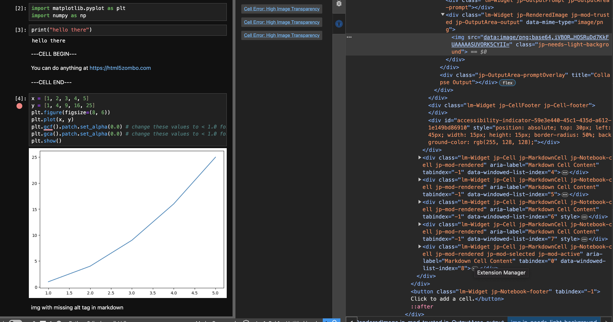

# jupyterlab_accessibility

[](https://github.com/github_username/jupyterlab_accessibility/actions/workflows/build.yml)[](https://mybinder.org/v2/gh/github_username/jupyterlab_accessibility/main?urlpath=lab)
description

## Issues


As you can see, even though the generated plot is about 96% transparent, therestill seems to be a white box behind it in a dark theme. This is because, only in images generated by code cells, there is a "jp-needs-light-background" class added to the image. This only happens when there is transparency in a code-generated image. If there is an image with transparency in a markdown cell, it isn't flagged.

What adds this property? Is it the iMimeRenderer, or is it something that the plt class recognizes and flags?

## Requirements

- JupyterLab >= 4.0.0

## Install

To install the extension, execute:

```bash
pip install jupyterlab_accessibility
```

## Uninstall

To remove the extension, execute:

```bash
pip uninstall jupyterlab_accessibility
```

## Contributing

### Development install

Note: You will need NodeJS to build the extension package.

The `jlpm` command is JupyterLab's pinned version of
[yarn](https://yarnpkg.com/) that is installed with JupyterLab. You may use
`yarn` or `npm` in lieu of `jlpm` below.

```bash
# Clone the repo to your local environment
# Change directory to the jupyterlab_accessibility directory
# Install package in development mode
pip install -e "."
# Link your development version of the extension with JupyterLab
jupyter labextension develop . --overwrite
# Rebuild extension Typescript source after making changes
jlpm build
```

You can watch the source directory and run JupyterLab at the same time in different terminals to watch for changes in the extension's source and automatically rebuild the extension.

```bash
# Watch the source directory in one terminal, automatically rebuilding when needed
jlpm watch
# Run JupyterLab in another terminal
jupyter lab
```

With the watch command running, every saved change will immediately be built locally and available in your running JupyterLab. Refresh JupyterLab to load the change in your browser (you may need to wait several seconds for the extension to be rebuilt).

By default, the `jlpm build` command generates the source maps for this extension to make it easier to debug using the browser dev tools. To also generate source maps for the JupyterLab core extensions, you can run the following command:

```bash
jupyter lab build --minimize=False
```

### Development uninstall

```bash
pip uninstall jupyterlab_accessibility
```

In development mode, you will also need to remove the symlink created by `jupyter labextension develop`
command. To find its location, you can run `jupyter labextension list` to figure out where the `labextensions`
folder is located. Then you can remove the symlink named `jupyterlab_accessibility` within that folder.

### Packaging the extension

See [RELEASE](RELEASE.md)
